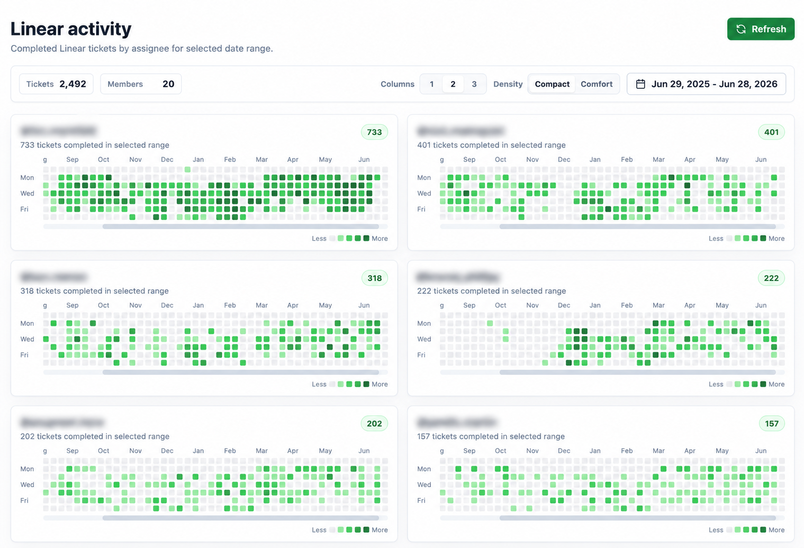

# Linear Activity Graph

GitHub-style activity graphs for Linear ticket completions by team member.



## Features

- Fetches completed Linear issues
- Groups completions by assignee
- Renders contribution-style activity heatmaps
- Supports date range presets and custom ranges
- Adjustable 1, 2, or 3 column layout
- Compact and comfortable graph density modes

## Setup

Install dependencies:

```bash
bun install
```

Create `.env`:

```bash
cp .env.example .env
```

Add a Linear personal API key:

```bash
LINEAR_API_KEY=lin_api_...
```

Start dev server:

```bash
bun run dev
```

Open the local URL printed by Vite.

## Scripts

```bash
bun run dev
bun run build
bun run preview
```
